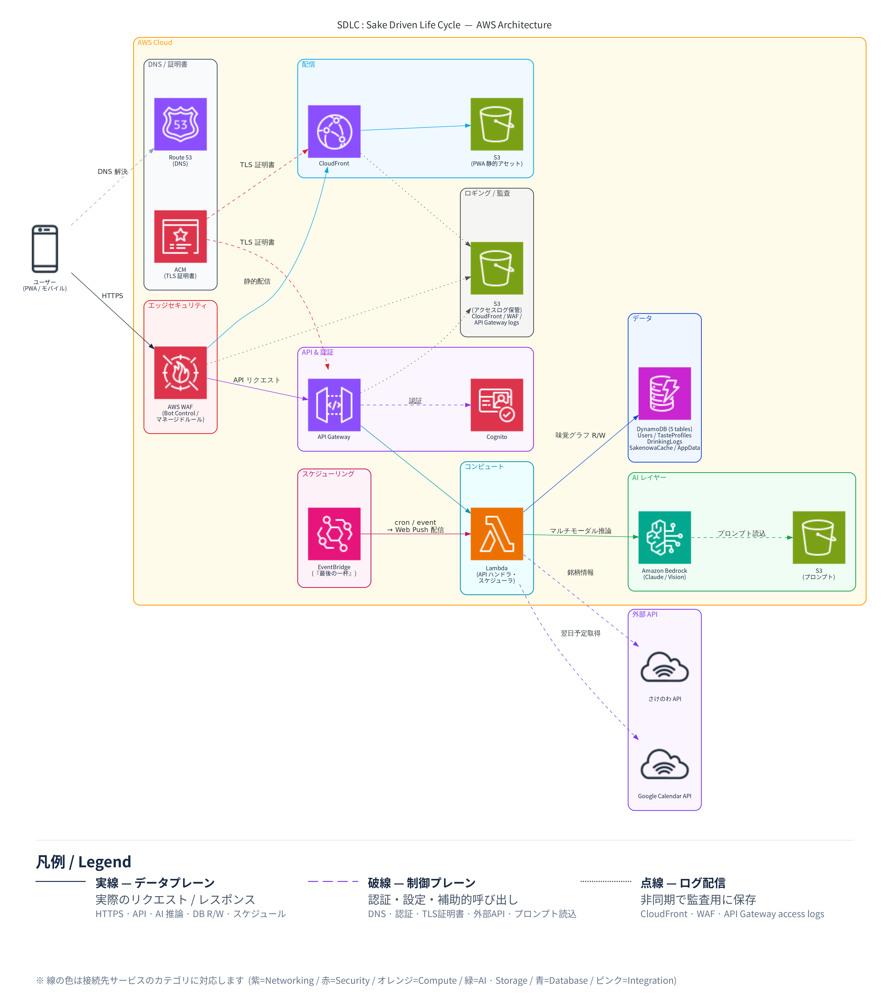

# sake-dlc

> **Sake Driven Life Cycle** — a PWA that designs your sake journey as a CI/CD pipeline (Plan → Build → Test → Deploy → Monitor → Optimize), where *"Don't Deploy Today"* is a first-class choice. Powered by Amazon Bedrock and the Sakenowa API.

**「人生のCI/CDに、和の余白を。」** — 飲む日も、飲まない日も、同じUIの上で設計する日本酒ライフサイクルアプリケーション。

---

## 背景: AWS Summit Japan 2026 AI-DLC ハッカソン

本プロジェクトは [**AWS Summit Japan 2026 AI-DLC ハッカソン**](https://pages.awscloud.com/summit-japan-2026-hackathon-reg.html) の参加作品として開発しています。

| 項目 | 内容 |
|---|---|
| テーマ | **「人をダメにするサービス」** — 生成AIで利便性を極限まで追求するアイデア |
| 開発手法 | **AI-DLC (AI Driven Lifecycle)** — AIが実行し人間が監督する、AI時代の新しい開発プロセス |
| 制約 | AWS上での開発・稼働、GitHubでの設計ドキュメント公開 |
| 評価軸 | ビジネス意図の明確さ / Unit分解の適切さ / 創造性とテーマ適合性 / ドキュメント品質 |

### テーマ「人をダメにする」への解釈

日本酒の選択にまつわる認知負荷を、すべてAIに肩代わりさせます。ユーザーは思考停止のまま"最適な一杯"または"最適な飲まない日"に到達できます。

- 1,400以上の蔵元から選べない → AIが料理・気分・体調から最適銘柄を即提示
- 飲むか飲まないかの葛藤 → 翌日の予定と体調から AIが「Don't Deploy Today」を即推奨
- 翌朝の後悔 → カレンダー連携で「最後の一杯」を自動通知
- 自分の好みが分からない → 味覚プロファイルが勝手に育つ

選ぶ・断る・覚える、その全部をやめさせる。それが本サービスの "人をダメにする" 価値です。

---

## アーキテクチャ

| レイヤー | コンポーネント |
|---|---|
| **CDN / 配信** | CloudFront (OAC) + S3 — PWA 静的ホスティング |
| **認証** | Amazon Cognito (SRP / MFA / Advanced Security) + WAF |
| **API** | API Gateway v2 (HTTP) → Lambda (Node.js 22 / Powertools v3) |
| **スケジューラー** | EventBridge → Lambda（日次バックアップ・通知） |
| **データ** | DynamoDB 5テーブル (Users / TasteProfiles / DrinkingLogs / SakenowaCache / AppData) |
| **AI** | Amazon Bedrock — Claude (テキスト推薦) / Claude Vision (料理写真解析) |
| **セキュリティ** | AWS KMS (HMAC リカバリーコード) / Secrets Manager / CloudTrail |
| **監視** | CloudWatch Logs + Metrics (EMF) + X-Ray + SNS アラート |
| **外部連携** | さけのわ API (銘柄データ) / Google Calendar API / Web Push (VAPID) |

線の凡例: **実線** = データプレーン (HTTPS / API / DB) / **破線** = 制御プレーン (認証・DNS・証明書) / **点線** = ログ配信 (監査ログ非同期保存)

---

## コンセプト

CI/CDの比喩を用いて、日本酒体験を6ステップのライフサイクルとして設計します。

| Step | 行動 |
|---|---|
| **Plan** | 今日飲むか・何を飲むかを設計 |
| **Build** | 銘柄・温度・器・適量を組み立てる |
| **Test** | ペアリングを検証する |
| **Deploy** | 実際に飲む（または **Skip Deploy** = 飲まない） |
| **Monitor** | 体調・味覚を記録 |
| **Optimize** | 翌日の予定から最後の一杯を最適化 |

特徴的なのは **「Skip Deploy（飲まない）」を一級市民として扱う** ことです。減酒志向や体調優先のライフスタイルにも、同じUIの上で自然に寄り添います。

---

## コア機能

| ID | 機能 | 概要 |
|---|---|---|
| FR-01 | Sake Recommendation Engine | 料理・気分・予定から銘柄×温度×適量×器を提案するソムリエAI |
| FR-02 | **Don't Deploy Today モード** | 体調・予定・服薬から「飲まない」を明確に推奨 |
| FR-03 | Pairing Lab | 料理写真をBedrock Visionで解析しペアリングを提案 |
| FR-04 | Sake Discovery | 酒蔵・産地・製法を多言語で学べる発見機能 |
| FR-05 | Next-Day Optimizer | カレンダー連携で「最後の一杯」を通知 |
| FR-06 | Personal Taste Graph | レーダーチャートで味覚プロファイルを可視化 |

---

## 技術スタック

### Frontend
- **React 19** + TypeScript + **Vite** (PWA: vite-plugin-pwa / Workbox)
- **React Router 7** — lazy loading + Protected Route
- **ky** — HTTP クライアント（beforeRequest / afterResponse フック）
- **i18next** — 多言語対応 (日本語 / 英語、静的バンドル)
- 将来のネイティブアプリ化 (Capacitor) を見据えた UI/ロジック分離

### Backend
- **AWS Lambda** (Node.js 22) + **Amazon API Gateway** v2 (TypeScript)
- **esbuild** — ESM バンドル、Lambda Layer 依存関係を external 化
- **AWS Lambda Powertools** (v3) — Logger (PII マスク) / Tracer (X-Ray) / Metrics (EMF)
- **Amazon Cognito** — SRP 認証, MFA (TOTP), Advanced Security ENFORCED
- **Amazon DynamoDB** (5テーブル: Users / TasteProfiles / DrinkingLogs / SakenowaCache / AppData)
- **AWS KMS** — GenerateMac (HMAC-SHA-256) によるリカバリーコード ハッシュ
- レート制限: DynamoDB ADD + ConditionExpression（固定ウィンドウ 100 req/min）

### AI / ML
- **Amazon Bedrock (Claude / Claude Vision)** — 推薦・画像解析・「飲まない判定」生成
- プロンプトテンプレートは S3 で管理

### External APIs
- **さけのわAPI** — 銘柄・蔵元・フレーバー情報（[sakenowa.com](https://sakenowa.com) 帰属表示）
- **Google Calendar API** — 翌日予定取得
- **Web Push (VAPID) + Amazon EventBridge** — プッシュ通知

### Infrastructure
- **Terraform** による IaC 管理（7モジュール: cognito / api-gateway / dynamodb / s3-cloudfront / lambda-base / monitoring）
- **Amazon S3 + Amazon CloudFront** (OAC) で PWA 配信
- **AWS CodeBuild** — CI ビルド仕様定義済み（CodePipeline 統合は Unit 6）

---

## AI-DLC によるユニット分解

本プロジェクトは AI-DLC 手法に従い、設計を6つのユニットに分解しています。Unit 1 を先行開発し、Unit 2〜6 を並行開発する戦略です。

| Unit | 名称 | 責務 |
|---|---|---|
| Unit 1 | **Foundation** | 共通基盤・認証・インフラ骨格・DynamoDBスキーマ |
| Unit 2 | AI Core | Bedrock 推薦・判定エンジン (FR-01, FR-02) |
| Unit 3 | Pairing & Discovery | ペアリング・蔵元発見 (FR-03, FR-04) |
| Unit 4 | Lifecycle Tracking | 飲酒記録・味覚グラフ (FR-06) |
| Unit 5 | External Integration | カレンダー・プッシュ通知 (FR-05) |
| Unit 6 | Infrastructure | インフラ統合・デプロイパイプライン |

詳細は [`aidlc-docs/inception/application-design/unit-of-work.md`](./aidlc-docs/inception/application-design/unit-of-work.md) を参照してください。

---

## ドキュメント

設計ドキュメントは [`aidlc-docs/`](./aidlc-docs/) 配下に集約しています。

### Inception フェーズ
- [要件定義](./aidlc-docs/inception/requirements/requirements.md)
- [ペルソナ](./aidlc-docs/inception/user-stories/personas.md) / [ユーザーストーリー](./aidlc-docs/inception/user-stories/stories.md)
- [アプリケーション設計](./aidlc-docs/inception/application-design/application-design.md)
- [コンポーネント定義](./aidlc-docs/inception/application-design/components.md) / [コンポーネント依存関係](./aidlc-docs/inception/application-design/component-dependency.md)
- [ユニット定義](./aidlc-docs/inception/application-design/unit-of-work.md) / [ユニット依存関係](./aidlc-docs/inception/application-design/unit-of-work-dependency.md)

### Construction フェーズ (進行中)
- [Unit 1: Foundation — 機能設計](./aidlc-docs/construction/unit1-foundation/functional-design/)
- [Unit 1: Foundation — NFR要件](./aidlc-docs/construction/unit1-foundation/nfr-requirements/)
- [Unit 1: Foundation — NFR設計](./aidlc-docs/construction/unit1-foundation/nfr-design/)
- [Unit 1: Foundation — コード生成計画 (全23ステップ)](./aidlc-docs/construction/plans/unit1-foundation-code-generation-plan.md)
- [Unit 1: Foundation — コードサマリー: バックエンド](./aidlc-docs/construction/unit1-foundation/code/backend-summary.md)
- [Unit 1: Foundation — コードサマリー: フロントエンド](./aidlc-docs/construction/unit1-foundation/code/frontend-summary.md)
- [Unit 1: Foundation — コードサマリー: インフラ](./aidlc-docs/construction/unit1-foundation/code/infrastructure-summary.md)

### プロセス追跡
- [AI-DLC State](./aidlc-docs/aidlc-state.md) — 各フェーズの進捗状況
- [監査ログ](./aidlc-docs/audit.md) — AI-DLC 各ステップの実行記録

---

## 開発ステータス

現在のフェーズ: **Construction / Unit 1 Foundation / Build & Test**

- [x] Inception: Workspace Detection / Requirements / User Stories / Workflow Planning / Application Design / Units Generation
- [x] Construction: Unit 1 Functional Design
- [x] Construction: Unit 1 NFR Requirements
- [x] Construction: Unit 1 NFR Design
- [x] Construction: Unit 1 Infrastructure Design
- [x] Construction: Unit 1 Code Generation（全23ステップ / フルスタック承認済）
- [ ] Construction: Unit 1 Build & Test
- [ ] Construction: Unit 2 〜 Unit 6
- [ ] Operations

---

## ターゲットユーザー

- 日本酒初心者（1,400以上の蔵元から選べない人）
- 減酒志向の20代〜30代
- インバウンド観光客（英語対応）
- 日本酒愛好家（ペアリング・味覚探求）

---

## License

[MIT License](./LICENSE)

---

## Disclaimer

本サービスは20歳以上を対象とします。飲酒は健康・運転・服薬等のリスクを伴うため、本アプリのレコメンドは医学的・法的助言ではありません。最終判断はユーザー自身の責任で行ってください。
