# SDLC — 実行計画

## 詳細分析サマリー

### 変更影響評価
- **ユーザー向け変更**: Yes — 6コア機能すべてがエンドユーザーと直接対話
- **構造変更**: Yes — 新規アーキテクチャ（フロントエンド SPA + AWS サーバーレスバックエンド）
- **データモデル変更**: Yes — Users, TasteProfiles, DrinkingLogs, SakenowaCache の新規テーブル設計
- **API変更**: Yes — REST API 新規設計（認証、推薦、ペアリング、履歴、Taste Graph、Discovery、Calendar連携）
- **NFR影響**: Yes — セキュリティ（SECURITY-01〜15）、PWA、多言語、パフォーマンス、PBT

### リスク評価
- **リスクレベル**: Medium
- **理由**: 外部API依存（さけのわ、Google Calendar、Bedrock）、マルチモーダルAI統合、PWAフル対応
- **ロールバック複雑度**: Moderate（サーバーレスのため個別コンポーネントのロールバックは容易）
- **テスト複雑度**: Complex（AI推論のテスト、外部API連携、PBT要件）

---

## ワークフロー可視化

```mermaid
flowchart TD
    Start(["ユーザーリクエスト"])

    subgraph INCEPTION["🔵 INCEPTION PHASE"]
        WD["Workspace Detection<br/><b>COMPLETED</b>"]
        RA["Requirements Analysis<br/><b>COMPLETED</b>"]
        US["User Stories<br/><b>COMPLETED</b>"]
        WP["Workflow Planning<br/><b>COMPLETED</b>"]
        AD["Application Design<br/><b>EXECUTE</b>"]
        UG["Units Generation<br/><b>EXECUTE</b>"]
    end

    subgraph CONSTRUCTION["🟢 CONSTRUCTION PHASE"]
        FD["Functional Design<br/><b>EXECUTE</b><br/>(per-unit)"]
        NFRA["NFR Requirements<br/><b>EXECUTE</b><br/>(per-unit)"]
        NFRD["NFR Design<br/><b>EXECUTE</b><br/>(per-unit)"]
        ID["Infrastructure Design<br/><b>EXECUTE</b><br/>(per-unit)"]
        CG["Code Generation<br/><b>EXECUTE</b><br/>(per-unit)"]
        BT["Build and Test<br/><b>EXECUTE</b>"]
    end

    Start --> WD
    WD --> RA
    RA --> US
    US --> WP
    WP --> AD
    AD --> UG
    UG --> FD
    FD --> NFRA
    NFRA --> NFRD
    NFRD --> ID
    ID --> CG
    CG -.->|Next Unit| FD
    CG --> BT
    BT --> End(["Complete"])

    style WD fill:#4CAF50,stroke:#1B5E20,stroke-width:3px,color:#fff
    style RA fill:#4CAF50,stroke:#1B5E20,stroke-width:3px,color:#fff
    style US fill:#4CAF50,stroke:#1B5E20,stroke-width:3px,color:#fff
    style WP fill:#4CAF50,stroke:#1B5E20,stroke-width:3px,color:#fff
    style AD fill:#FFA726,stroke:#E65100,stroke-width:3px,stroke-dasharray: 5 5,color:#000
    style UG fill:#FFA726,stroke:#E65100,stroke-width:3px,stroke-dasharray: 5 5,color:#000
    style FD fill:#FFA726,stroke:#E65100,stroke-width:3px,stroke-dasharray: 5 5,color:#000
    style NFRA fill:#FFA726,stroke:#E65100,stroke-width:3px,stroke-dasharray: 5 5,color:#000
    style NFRD fill:#FFA726,stroke:#E65100,stroke-width:3px,stroke-dasharray: 5 5,color:#000
    style ID fill:#FFA726,stroke:#E65100,stroke-width:3px,stroke-dasharray: 5 5,color:#000
    style CG fill:#4CAF50,stroke:#1B5E20,stroke-width:3px,color:#fff
    style BT fill:#4CAF50,stroke:#1B5E20,stroke-width:3px,color:#fff
    style INCEPTION fill:#BBDEFB,stroke:#1565C0,stroke-width:3px,color:#000
    style CONSTRUCTION fill:#C8E6C9,stroke:#2E7D32,stroke-width:3px,color:#000
    style Start fill:#CE93D8,stroke:#6A1B9A,stroke-width:3px,color:#000
    style End fill:#CE93D8,stroke:#6A1B9A,stroke-width:3px,color:#000
    linkStyle default stroke:#333,stroke-width:2px
```



### テキスト代替
```
Phase 1: INCEPTION
  - Workspace Detection (COMPLETED)
  - Requirements Analysis (COMPLETED)
  - User Stories (COMPLETED)
  - Workflow Planning (COMPLETED)
  - Application Design (EXECUTE)
  - Units Generation (EXECUTE)

Phase 2: CONSTRUCTION (per-unit loop)
  - Functional Design (EXECUTE, per-unit)
  - NFR Requirements (EXECUTE, per-unit)
  - NFR Design (EXECUTE, per-unit)
  - Infrastructure Design (EXECUTE, per-unit)
  - Code Generation (EXECUTE, per-unit)
  - Build and Test (EXECUTE, after all units)
```

---

## 実行するフェーズ

### 🔵 INCEPTION PHASE
- [x] Workspace Detection (COMPLETED)
- [x] Requirements Analysis (COMPLETED)
- [x] User Stories (COMPLETED)
- [x] Workflow Planning (COMPLETED)
- [ ] Application Design - EXECUTE
  - **理由**: 新規プロジェクトで複数のコンポーネント・サービスが必要。フロントエンド（React SPA）、バックエンド（Lambda関数群）、AI統合層、外部API連携層、データ層の設計が必要
- [ ] Units Generation - EXECUTE
  - **理由**: 6コア機能 + 認証 + インフラで複数のユニットに分解が必要。並行開発可能な単位への分割が重要

### 🟢 CONSTRUCTION PHASE (per-unit)
- [ ] Functional Design - EXECUTE
  - **理由**: AI推論ロジック、飲酒判定ロジック、味覚スコア計算等の複雑なビジネスロジックの詳細設計が必要
- [ ] NFR Requirements - EXECUTE
  - **理由**: SECURITY-01〜15、PBT-01〜10の全ルール適用。パフォーマンス、PWA、多言語の要件定義が必要
- [ ] NFR Design - EXECUTE
  - **理由**: セキュリティパターン、キャッシュ戦略、オフライン対応、プッシュ通知の設計が必要
- [ ] Infrastructure Design - EXECUTE
  - **理由**: AWS サーバーレス構成（API Gateway, Lambda, DynamoDB, Bedrock, Cognito, S3, CloudFront, EventBridge, Web Push VAPID）のインフラ設計が必要
- [ ] Code Generation - EXECUTE (ALWAYS)
  - **理由**: 実装計画の策定とコード生成
- [ ] Build and Test - EXECUTE (ALWAYS)
  - **理由**: ビルド手順、テスト実行手順の策定

### 🟡 OPERATIONS PHASE
- [ ] Operations - PLACEHOLDER

---

## スキップするフェーズ
- Reverse Engineering — SKIP（グリーンフィールドプロジェクトのため不要）

---

## 成功基準
- **主要目標**: SDLCピッチデッキの6コア機能すべてが動作するWebアプリケーション
- **主要成果物**:
  - React + TypeScript SPA（PWA対応、日英2言語）
  - AWS サーバーレスバックエンド（API Gateway + Lambda + DynamoDB）
  - Bedrock Claude 統合（テキスト推論 + Vision）
  - さけのわAPI連携（TTLキャッシュ）
  - Google Calendar連携
  - Cognito認証（メール＋ソーシャルログイン）
- **品質ゲート**:
  - SECURITY-01〜15 全ルール準拠
  - PBT-01〜10 全ルール準拠
  - 例示ベーステスト + プロパティベーステスト
